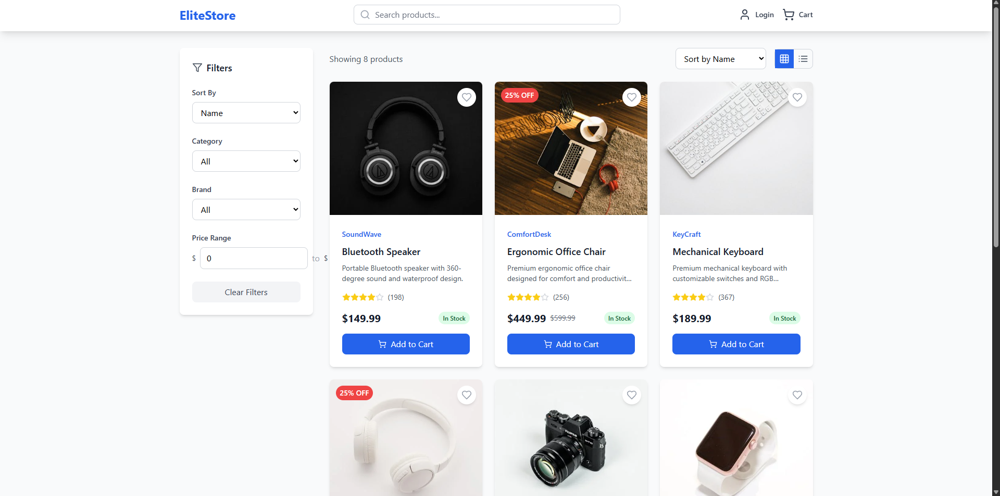
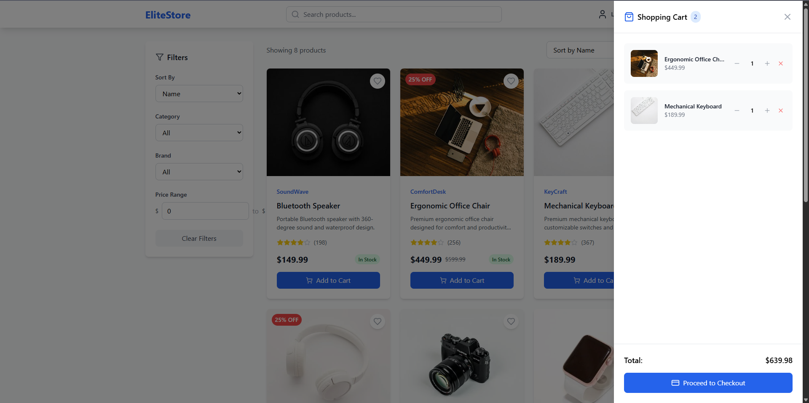
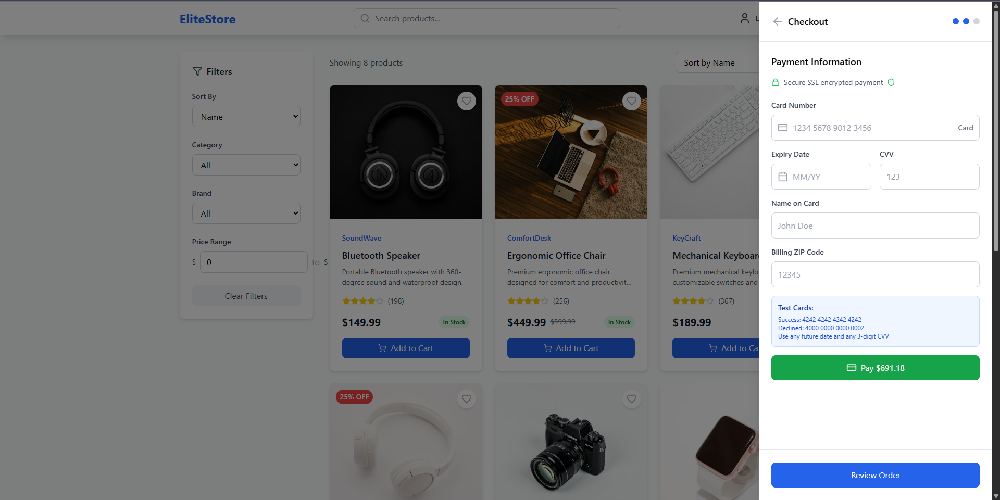

# EliteStore - Advanced E-commerce Platform

A modern, feature-rich e-commerce store built with React, TypeScript, and Tailwind CSS. This application provides a complete shopping experience with advanced features including product filtering, cart management, user authentication, and a simulated payment system.





## 🚀 Features

### Core Functionality
- **Product Catalog**: Browse products with detailed information, ratings, and reviews
- **Advanced Search**: Real-time search across product names, descriptions, and tags
- **Smart Filtering**: Filter by category, brand, price range with dynamic sorting options
- **View Modes**: Switch between grid and list views for optimal browsing experience
- **Shopping Cart**: Add, remove, and modify quantities with real-time total calculations
- **User Authentication**: Secure login/registration system with form validation
- **Checkout Process**: Multi-step checkout with shipping and payment information
- **Payment Simulation**: Complete payment form with card validation and processing simulation

### User Experience
- **Responsive Design**: Optimized for desktop, tablet, and mobile devices
- **Modern UI**: Clean, professional design with smooth animations and micro-interactions
- **Real-time Updates**: Instant feedback for all user actions
- **Loading States**: Visual feedback during authentication and payment processing
- **Error Handling**: Comprehensive error messages and validation feedback

### Technical Features
- **TypeScript**: Full type safety throughout the application
- **Context API**: Efficient state management for cart and authentication
- **Component Architecture**: Modular, reusable components with clear separation of concerns
- **Performance Optimized**: Memoized calculations and efficient re-rendering

## 🛠️ Technology Stack

- **Frontend Framework**: React 18 with TypeScript
- **Styling**: Tailwind CSS for responsive design
- **Icons**: Lucide React for consistent iconography
- **Build Tool**: Vite for fast development and optimized builds
- **State Management**: React Context API with useReducer
- **Form Handling**: Custom validation with real-time feedback

## 📦 Installation

1. **Clone the repository**
   ```bash
   git clone https://github.com/priyanshu7855/E-commerce
   cd E-commerce
   ```

2. **Install dependencies**
   ```bash
   npm install
   ```

3. **Start the development server**
   ```bash
   npm run dev
   ```

4. **Open your browser**
   Navigate to `http://localhost:5173` to view the application

## 🎯 Usage Guide

### Authentication
- **Demo Login**: Use `admin@example.com` / `admin123` for quick access
- **Registration**: Create new accounts with email validation
- **Features**: Personalized greetings, secure logout, form validation

### Shopping Experience
1. **Browse Products**: Use search bar or browse by categories
2. **Filter & Sort**: Apply filters for category, brand, price range
3. **View Products**: Switch between grid/list views
4. **Add to Cart**: Click "Add to Cart" on any product
5. **Manage Cart**: View cart, modify quantities, remove items
6. **Checkout**: Complete multi-step checkout process

### Payment Testing
Use these test card numbers for different scenarios:

| Card Number | Scenario | CVV | Expiry |
|-------------|----------|-----|--------|
| `4242 4242 4242 4242` | Successful Payment | Any 3 digits | Any future date |
| `4000 0000 0000 0002` | Card Declined | Any 3 digits | Any future date |
| `4000 0000 0000 0127` | Incorrect Security Code | Any 3 digits | Any future date |
| `4000 0000 0000 0069` | Expired Card | Any 3 digits | Any future date |

## 🏗️ Project Structure

```
src/
├── components/          # Reusable UI components
│   ├── AuthModal.tsx   # Login/Registration modal
│   ├── Cart.tsx        # Shopping cart sidebar
│   ├── Checkout.tsx    # Multi-step checkout process
│   ├── Filters.tsx     # Product filtering sidebar
│   ├── Header.tsx      # Navigation header
│   ├── PaymentForm.tsx # Payment form with validation
│   ├── ProductCard.tsx # Individual product display
│   └── ProductGrid.tsx # Product listing with view modes
├── context/            # React Context providers
│   ├── AuthContext.tsx # Authentication state management
│   └── CartContext.tsx # Shopping cart state management
├── data/               # Static data and configurations
│   └── products.ts     # Product catalog data
├── types/              # TypeScript type definitions
│   └── index.ts        # Shared interfaces and types
├── App.tsx             # Main application component
├── main.tsx            # Application entry point
└── index.css           # Global styles and Tailwind imports
```

## 🎨 Design System

### Color Palette
- **Primary**: Blue (#3B82F6) - Main brand color for buttons and links
- **Secondary**: Teal (#14B8A6) - Accent color for success states
- **Accent**: Orange (#F97316) - Highlight color for promotions
- **Success**: Green (#10B981) - Confirmation and success messages
- **Warning**: Yellow (#F59E0B) - Warning states and alerts
- **Error**: Red (#EF4444) - Error states and validation
- **Neutral**: Gray scale for text and backgrounds

### Typography
- **Headings**: Bold weights with proper hierarchy (h1-h6)
- **Body Text**: Regular weight with 150% line height for readability
- **Small Text**: Used for metadata and secondary information

### Spacing System
- **Base Unit**: 8px grid system for consistent spacing
- **Components**: Proper padding and margins following design principles
- **Layout**: Responsive breakpoints for mobile-first design

## 🔧 Development

### Available Scripts
- `npm run dev` - Start development server
- `npm run build` - Build for production
- `npm run preview` - Preview production build
- `npm run lint` - Run ESLint for code quality

### Code Quality
- **TypeScript**: Strict type checking enabled
- **ESLint**: Configured for React and TypeScript best practices
- **Component Structure**: Each component focuses on single responsibility
- **State Management**: Centralized state with Context API

### Performance Considerations
- **Memoization**: useMemo for expensive calculations (product filtering)
- **Component Optimization**: Proper key props and minimal re-renders
- **Image Optimization**: Responsive images with proper loading
- **Bundle Size**: Tree-shaking enabled with Vite

## 🚀 Deployment

### Build for Production
```bash
npm run build
```

### Preview Production Build
```bash
npm run preview
```

The build artifacts will be stored in the `dist/` directory, ready for deployment to any static hosting service.

## 🤝 Contributing

1. Fork the repository
2. Create a feature branch (`git checkout -b feature/amazing-feature`)
3. Commit your changes (`git commit -m 'Add amazing feature'`)
4. Push to the branch (`git push origin feature/amazing-feature`)
5. Open a Pull Request


## 🙏 Acknowledgments

- **React Team** - For the amazing framework
- **Tailwind CSS** - For the utility-first CSS framework
- **Lucide** - For the beautiful icon set
- **Pexels** - For the high-quality product images
- **Vite** - For the lightning-fast build tool

## 📞 Support

For support, create an issue in the repository.

---

**EliteStore** - Delivering exceptional e-commerce experiences with modern web technologies.
